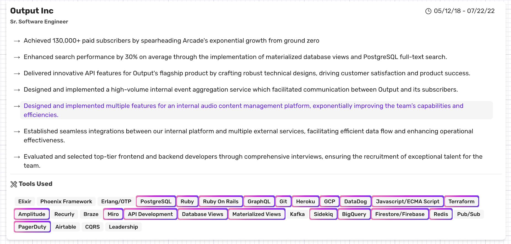

👋 Heyo 👋

Thanks for popping in. My name is Mark Sadegi and I'm thankful everyday to be able to earn a living from programming! Below are some public repos that I occasionally improve and often refer to when I want to reference a concept. Also, a link to my portfolio and sample writings are listed. 

## Notable Pubic Repos
1. [Bike Shop](https://github.com/marka2g/bike_shop): A demo e-commerce app with a basic example of how to build a shopping cart with [GenServer](https://hexdocs.pm/elixir/GenServer.html).
2. [EventIngestor](https://github.com/marka2g/event_ingestor): A demo repo to simulate an app which will ingest a high-volume of events that could come from a device, user behavior, machine on a factory floor, etc.  Built with Elixir

## Portfolio 
[https://www.marksadegi.com](www.marksadegi.com){target="_blank"}
>__Rollover the individual responsibilities to highlight all the technologies used for that responsibility.__
